## Create
### QuerySet API 실습 사전 준비
- 외부 라이브러리 설치 및 설정
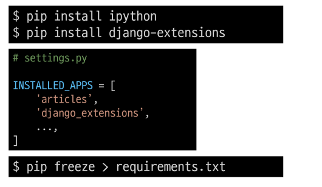

### Django shell
- Django 환경 안에서 실행되는 python shell(입력하는 QuerySet API 구문이 Django 프로젝트에 영향을 미침)

### Django shell 실행
~~~bash
$ python manage.py shell_plus
~~~

### 데이터 객체를 만드는(생성하는) 3가지 방법
#### 첫번째 방법
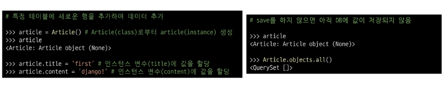

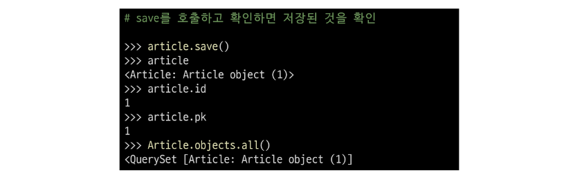

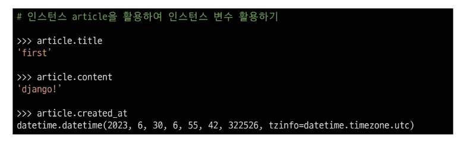

#### 두번째 방법
- save 메서드를 호출해야 비로소 DB에 데이터가 저장됨
- 테이블에 한 행(레코드)이 쓰여진 것
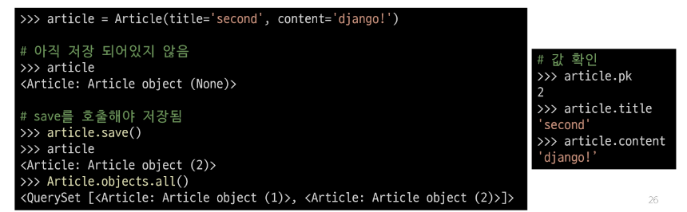

#### 세번째 방법
- QuerySet API 중 create() 메서드 활용
- 바로 초기값 받아서 DB에 저장하는 것
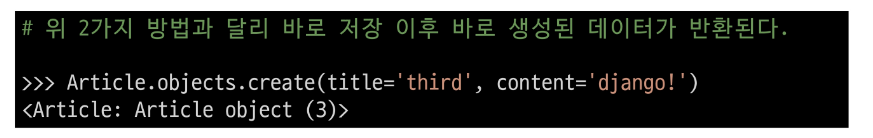

### save()
- 객체를 데이터베이스에 저장하는 인스턴스 메서드 -> Model이라는 객체 안에 있음

## Read
### 대표적인 조회 메서드
- Return new QuerySets
    - all()
    - filter()
    - 반환이 있음

- Do not return QuerySets
    - get()

### all()
- 전체 데이터 조회
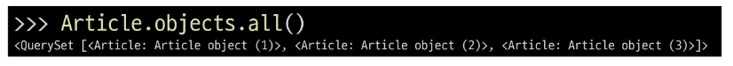

### filter()
- 주어진 매개변수와 일치하는 객체를 포함하는 QuerySet 반환
- filter를 활용해서 조회하면 QuerySet으로 나옴
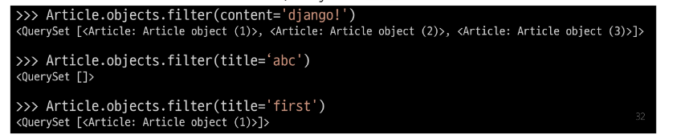

### get()
- 주어진 매개변수와 일치하는 객체를 반환
- Query Set을 주지 않음
- pk(유일한 값)이 있는 값에만 사용해야함
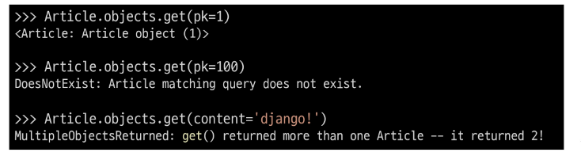

#### get() 특징
- 객체를 찾을 수 없으면 DoesNotExist 예외를 발생시키고, 둘 이상의 객체를 찾으면 MultipleObjectsReturned 예외를 발생시킴
- 위와 같은 특징을 가지고 있기 때문에 primary key와 같이 고유성(uniqueness)을 보장하는 조회에서 사용해야 함

## Update
### 데이터 수정
- 데이터를 수정하려면 조회부터 해야함
- 인스턴스 변수를 변경 후 save 메서드 호출
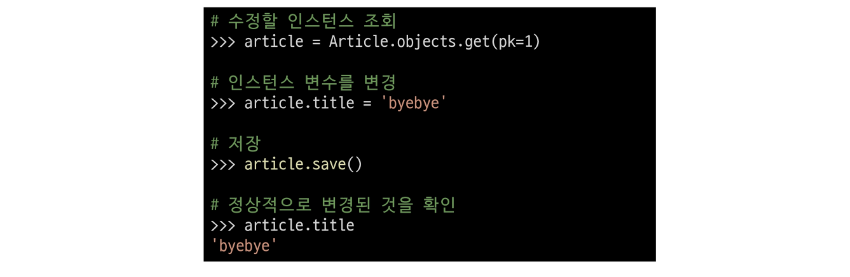

## Delete
### 데이터 삭제
- 데이터를 삭제하려면 조회부터 해야함
- 삭제하려는 데이터 조회 후 delete 메서드 호출
- 튜플로 반환
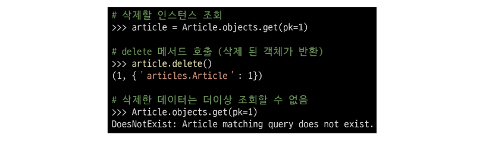
