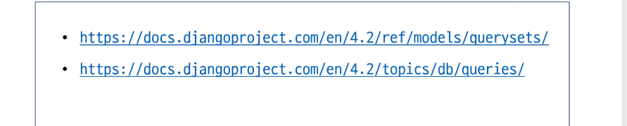

## Field lookups
- Query에서 조건을 구성하는 방법
- QuerySet메서드 filter(), exclude() 및 get()에 대한 키워드 인자로 지정됨

## ORM, QuerySet API를 사용하는 이유
1. 데이터베이스 추상화
    - 개발자는 특정 데이터베이스 시스템에 종속되지 일관된 방식으로 데이터를 다룰 수 있음

2. 생산성 향상
    - 복잡한 SQL 쿼리를 직접 작성하는 대신 Python 코드로 데이터베이스 작업을 수행할 수 있음

3. 객체 지향적 접근
    - 데이터베이스 테이블을 Python 객체로 다룰 수 있어 객체 지행 프로그래밍의 이점을 활용할 수 있음

### QuerySet API 관련 문서

