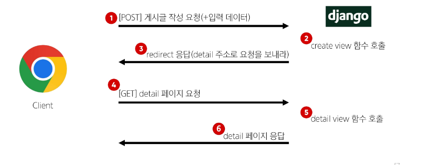

## HTTP response status code
- 서버가 클라이언트의 요청에 대한 처리 결과를 나타내는 3자리 숫자

### HTTP response status code의 역할
- 클라이언트에게 요청 처리 결과를 명확히 전달
- 문제 발생 시 디버깅에 도움
- 웹 애플리케이션의 동작을 제어하는 데 사용

### 403 Forbidden
- 서버에 요청이 전달되었지만, 권한 때문에 거절되었다는 것을 의미

### 거절 된 이유
"CSRF token이 누락되었다" 라는 응답

## CSRF(Cross-Site-Request-Forgery)
"사이트 간 요청 위조"
- 사용자가 자신의 의지와 무관하게 공격자가 의도한 행동을 하여 특정 웹 페이지를 보안에 취약하게 하거나 수정, 삭제 등의 작업을 하게 만드는 공격 방법
- POST Method는 무조건 CSRF-token을 확인함

### CSRF Token 적용
- DTL의 csrf_token 태그를 사용해 손쉽게 사용자에게 토큰 값을 부여
- 요청 시 토큰 값도 함께 서버로 전송될 수 있도록 하는 것

### 요청 시 CSRF Token을 함께 보내야 하는 이유
- Django 서버는 해당 요청이 DB에 데이터를 하나 생성하는(DB에 영향을 주는) 요청에 대해 "Django가 직접 제공한 페이지에서 데이터를 작성하고 있는 것인지"에 대한 확인 수단이 필요한 것
- 겉모습이 똑같은 위조 사이트나 정상적이지 않은 요청에 대한 방어 수단
- 기존
  - 요청 데이터 -> 게시글 작성
- 변경
  - 요청 데이터 + 인증 토큰 -> 게시글 작성

### 그런데 왜 POST일 때만 Token을 확인할까?
- POST는 단순 조회를 위한 GET과 달리 특정 리소스에 변경(생성, 수정, 삭제)을 요구하는 의미와 기술적인 부분을 가지고 있기 때문
- DB에 조작을 가하는 요청은 반드시 인증 수단이 필요
- 데이터베이스에 대한 변경사항을 만드는 요청이기 때문에 토큰을 사용해 최소한의 신원 확인을 하는 것

### 게시글 작성 결과
- 게시글 생성 후 개발자 도구를 사용해 Form Data가 전송되는 것 확인
- 더 이상 URL에 Query String 형태로 보냈던 데이터가 표기되지 않음

## Redirect
### 게시글 작성 후 완료를 알리는 페이지를 응답한다 ?
- 게시글을 "조회해줘!" 라는 요청이 아닌 "작성해줘!" 라는 요청이기 때문에 게시글 저장 후 페이지를 응답하는 것은 POST 요청에 대한 적절한 응답이 아님
- 서버는 데이터 저장 후 페이지를 응답하는 것이 아닌 사용자를 적절한 기존 페이지로 보내야 함
  - "사용자를 보낸다." -> "사용자가 GET 요청을 한번 더 보내도록 해야 한다."
  - 실제로 서버가 클라이언트를 직접 다른 페이지로 보내는 것이 아닌 클라이언트가 GET 요청을 한번 더 보내도록 응답하는 것

### redirect()
- 클라이언트가 인자에 작성된 주소로 다시 요청을 보내도록 하는 함수

#### redirect() 함수 적용
- create view 함수 변경

### redirect 동작 원리
1. redirect 응답을 받은 클라이언트는 detail url로 다시 요청을 보내게 됨
2. 결과적으로 detail view 함수가 호출되어 detail view 함수의 반환 결과인 detail 페이지를 응답 받게 되는 것
- 결국 사용자는 게시글 작성 후 작성된 게시글의 detail 페이지로 이동하는 것으로 느끼게 됨

#### 게시글 작성 결과
- 게시글 작성 후 생성 된 게시글의 detail 페이지로 redirect 되었는지 확인
- create 요청 이후에 detail로 다시 요청을 보냈다는 것을 알 수 있음

## Delete
### Delete 기능 구현

## Update
### Update 로직을 구현하기 위해 필요한 view 함수의 개수는?
1. 사용자 입력 데이터를 받을 페이지를 렌더링 -> edit
2. 사용자가 입력한 데이터를 받아 DB에 저장 -> update

### Edit 기능 구현

### Update 기능 구현

