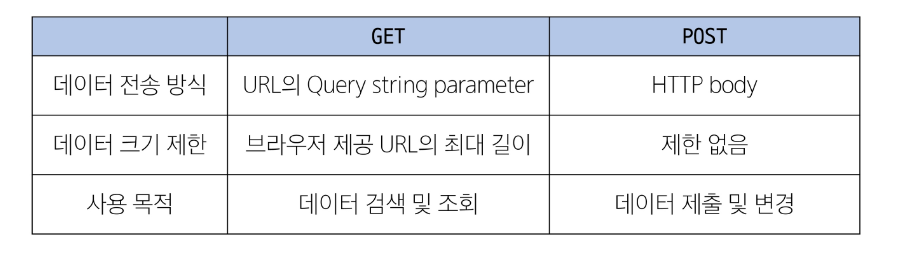

## GET & POST 비교

### GET 요청이 필요한 경우
- 캐싱 및 성능
  - GET 요청은 캐시(Cache)될 수 있고, 이전에 요청한 정보를 새로 요청하지 않고 사용할 수 있음
  - 특히, 동일한 검색 결과를 여러 번 요청하는 경우 GET 요청은 캐시를 활용하여 더 빠르게 응답할 수 있음
  
- 가시성 및 공유
  - GET 요청은 URL에 데이터가 노출되어 있기 때문에 사용자가 해당 URL을 북마크하거나 다른 사람과 공유하기 용이

- RESTful API 설계
  - HTTP 메서드의 의미에 따라 동작하도록 디자인된 API의 일관성을 유지할 수 있음

### HTTP request methods를 활용한 효율적인 URL 구성
- 동일한 URL 한 개로 method에 따라 서버에 요구하는 행동을 다르게 요구
- Django 후반기 RESTful API 시간에 다룰 예정

## 캐시(Cache)
- 데이터나 정보를 임시로 저장해두는 메모리나 디스크 공간
- 이전에 접근한 데이터를 빠르게 검색하고 접근할 수 있도록 함
