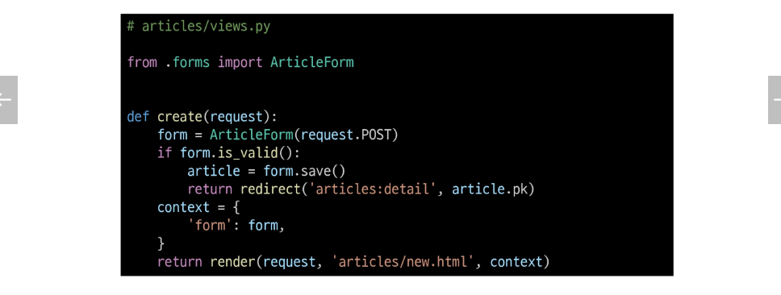

## Django ModelForm
### Form
- 사용자 입력 데이터를 DB에 저장하지 않을 때(ex. 검색, 로그인)

### ModelForm
- 사용자 입력 데이터를 DB에 저장해야 할 때(ex. 게시글 작성, 회원가입)

## Meta class
- ModelForm의 정보를 작성하는 곳

### 'fields' 및 'exclude' 속성
- exclude 속성을 사용하여 모델에서 포함하지 않을 필드를 지정할 수도 있음

### Meta class 주의사항
- Django에서 ModelForm에 대한 추가 정보나 속성을 작성하는 클래스 구조를 Meta 클래스로 작성 했을 뿐이며, 파이썬의 inner class와 같은 문법적인 관점으로 접근하지 말 것

## ModelFrom 적용
### ModelForm을 적용한 create 로직

