## View 함수 구조 변화
### new & create view 함수간 공통점과 차이점
#### 공통점
- "데이터 생성을 구현하기 위함"

#### 차이점
- "new는 GET method 요청만을, create는 POST method 요청만을 처리"

### HTTP request method 차이점을 활용해 동일한 목적을 가지는 2개의 view 함수를 하나로 구조화

## new & create 함수 결합
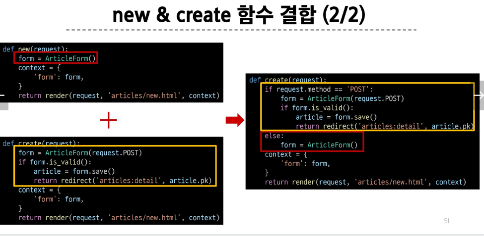

### 새로운 create view 함수
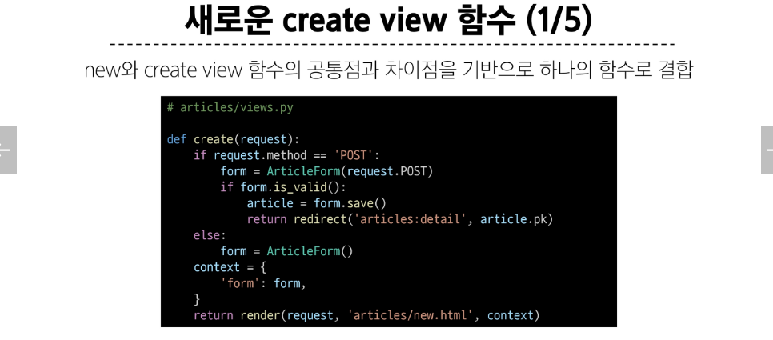

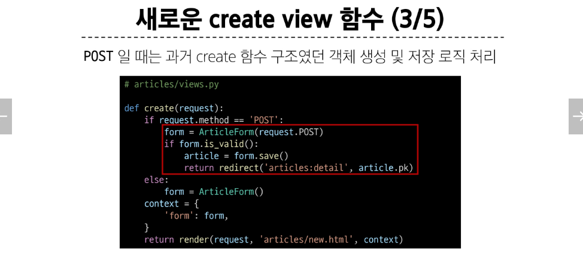
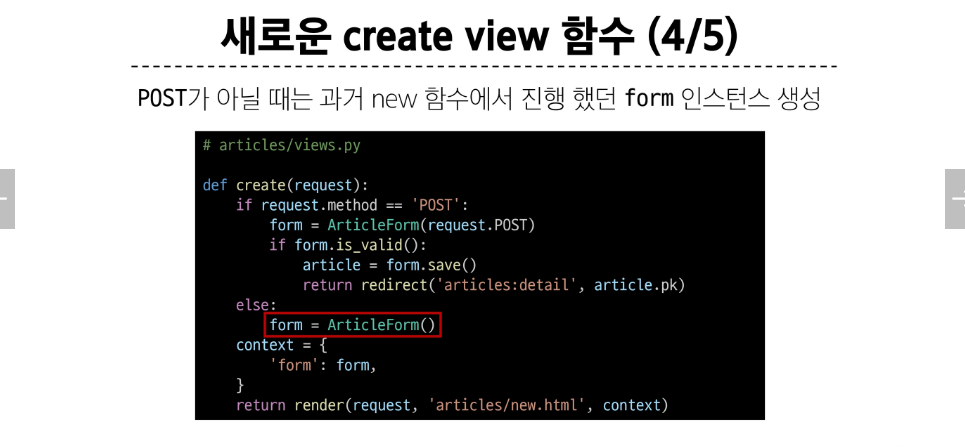
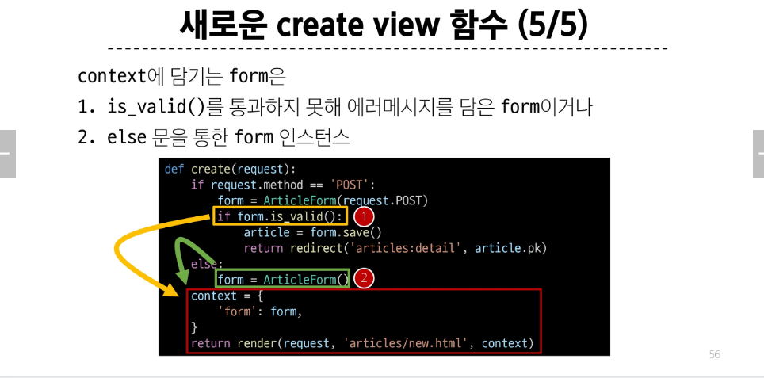

### 기존 new 관련 코드 수정
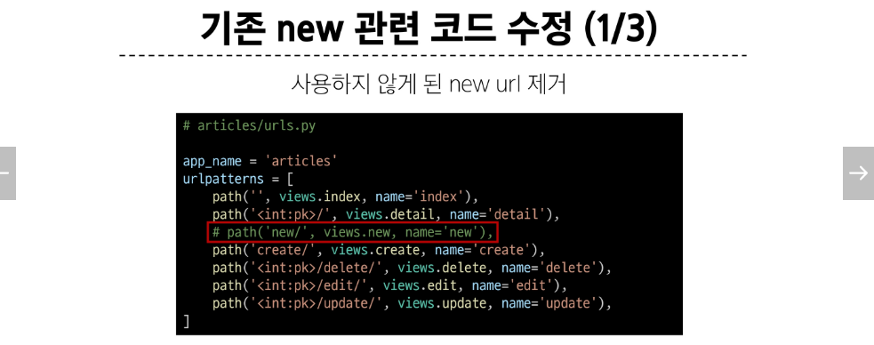
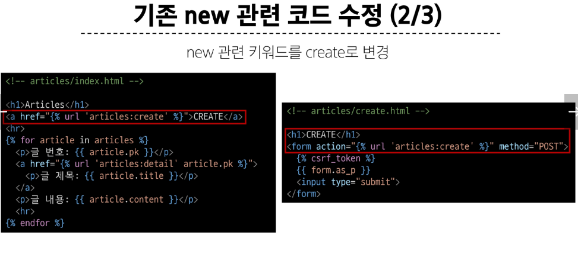
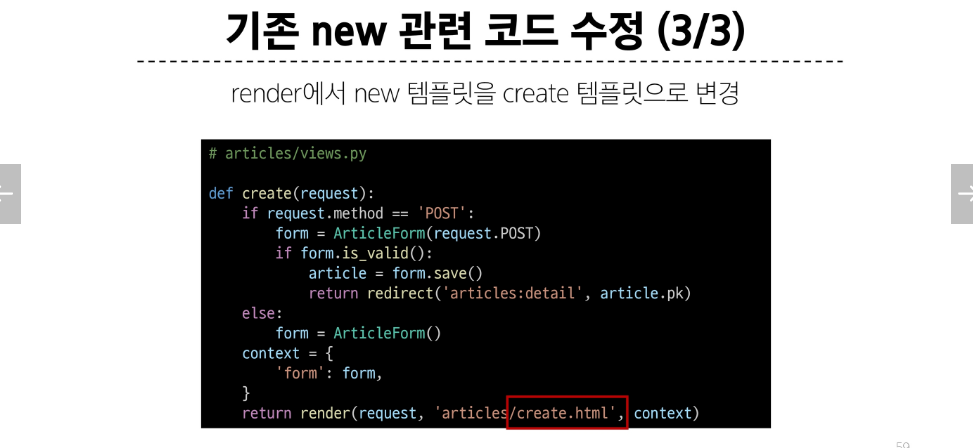

## edit & update 함수 결합
### 새로운 update view 함수
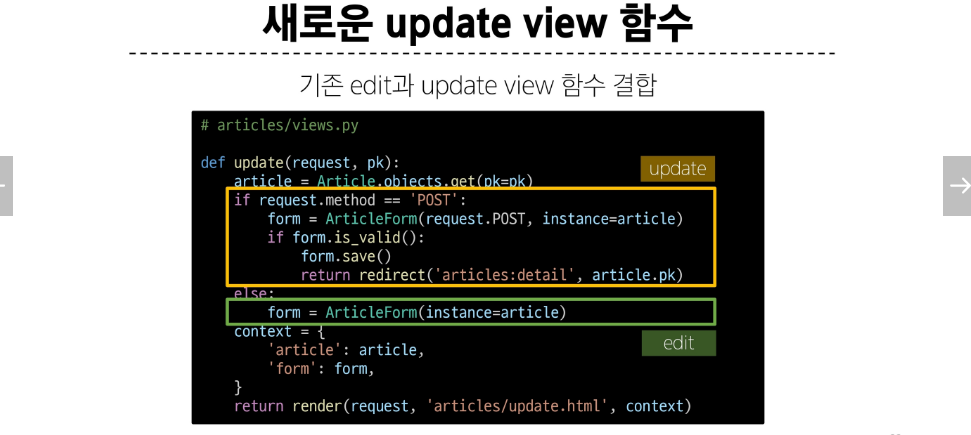

### 기존 edit 관련 코드 수정
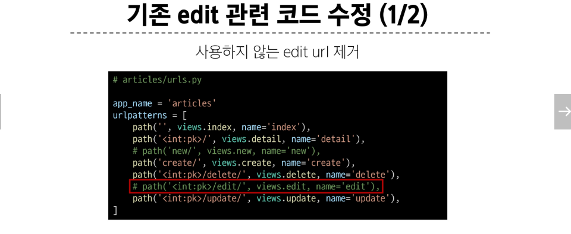
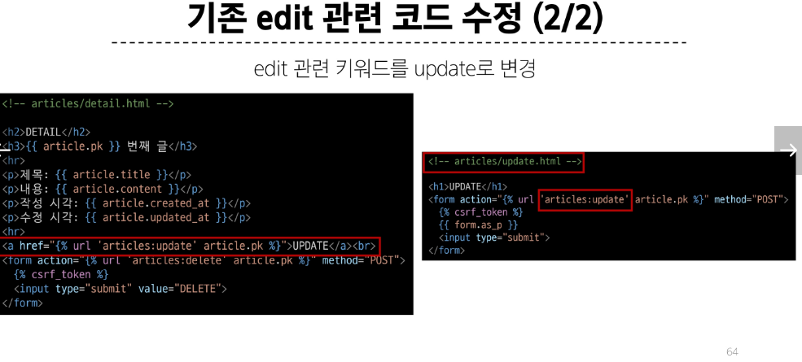

