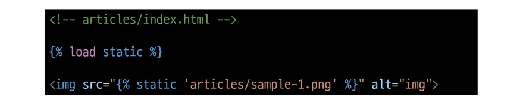
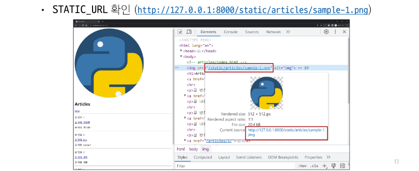
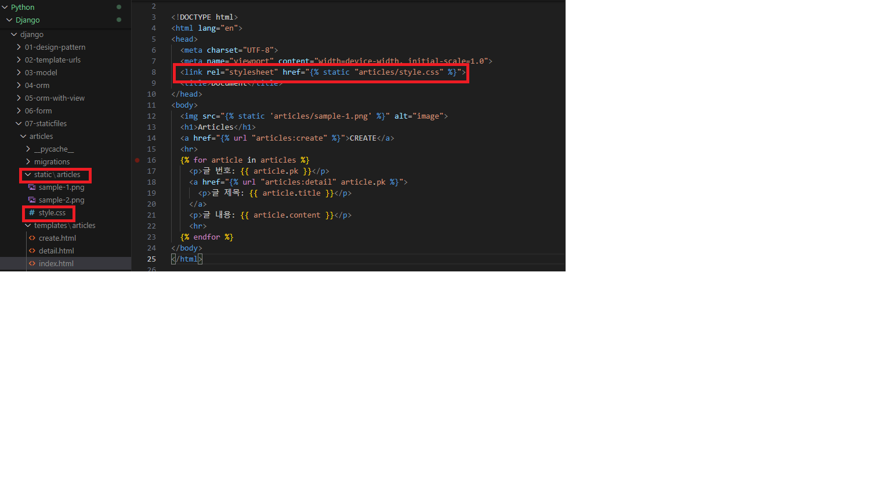
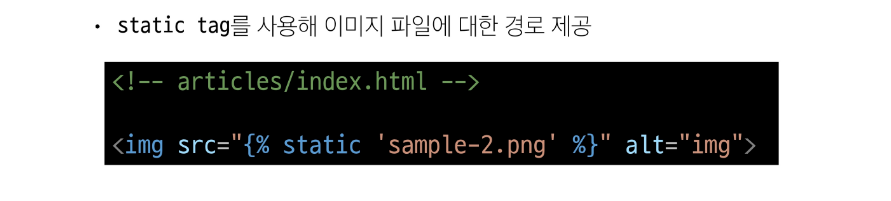

## Static files(정적 파일)
- 서버 측에서 변경되지 않고 고정적으로 제공되는 파일(이미지, JS, CSS 파일 등)

### 웹 서버와 정적 파일
- 웹 서버의 기본동작은 특정 위치(URL)에 있는 자원을 요청(HTTP request) 받아서 응답(HTTP response)을 처리하고 제공하는 것
- 이는 "자원에 접근 가능한 주소가 있다" 라는 의미
- 웹 서버는 요청 받은 URL로 서버에 존재하는 정적 자원을 제공함
- <strong>정적 파일을 제공하기 위한 경로(URL)가</strong> 있어야 함

### Static files 경로
1. 기본 경로
2. 추가 경로

## Static files 기본 경로
- app폴더/static/

### 기본 경로 static file 제공하기

- static files 경로는 DTL의 static tag를 사용해야 함
- built-in tag가 아니기 때문에 load tag를 사용해 import 후 사용 가능

### STATIC_URL
- 기본 경로 및 추가 경로에 위치한 정적 파일을 참조하기 위한 URL
- <strong>실제 파일이나 디렉토리 경로가 아니며, URL로만 존재</strong>
~~~Python
# settings.py

STATIC_URL = 'static/'
~~~

<strong>URL + STATIC_URL + 정적파일 경로</strong>
http://127.0.0.1:8000/static/articles/sample-1.png

## Static files 추가 경로
- STATICFILES_DIRS에 문자열 값으로 추가 경로 설정

### STATICFILES_DIRS
- 정적 파일의 기본 경로 외에 추가적인 경로 목록을 정의하는 리스트

### 추가 경로 static file 제공하기

### 정적 파일을 제공하려면 요청에 응답하기 위한 URL이 필요
