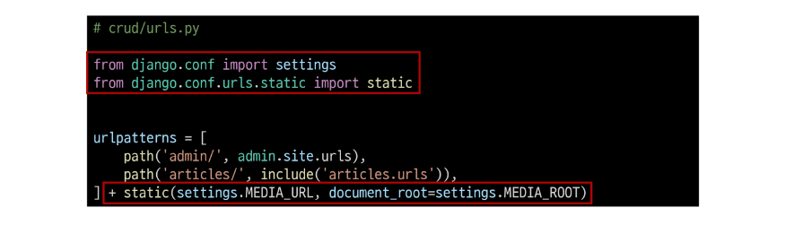
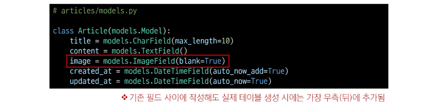
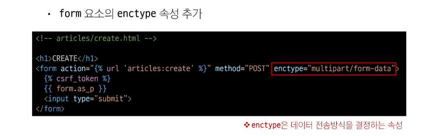
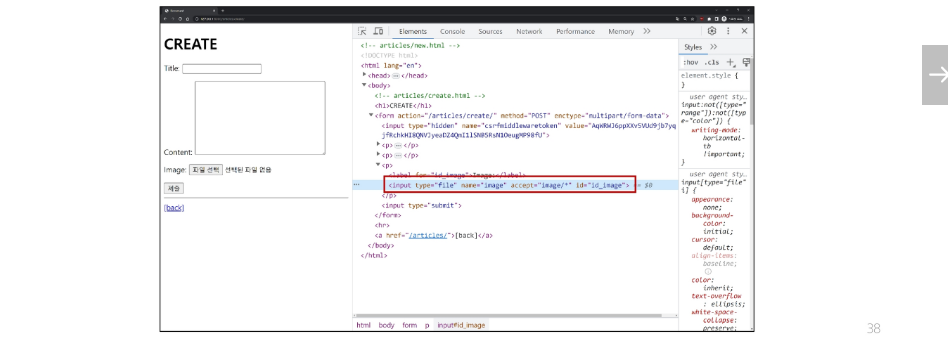
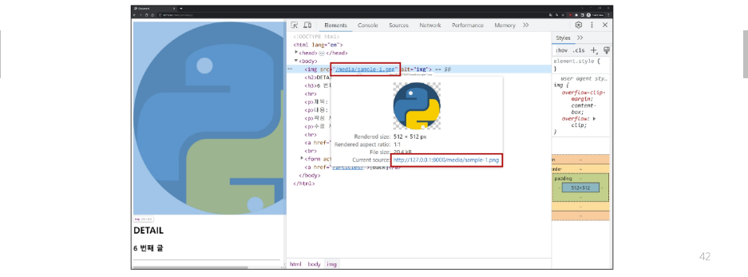
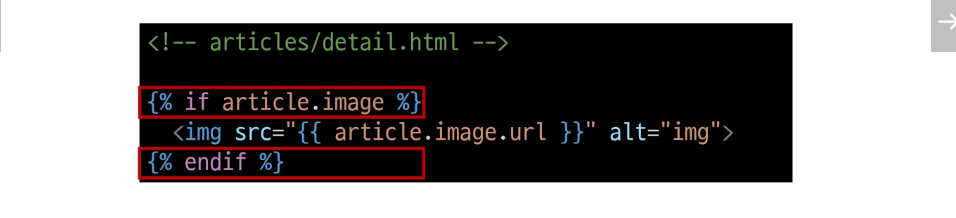
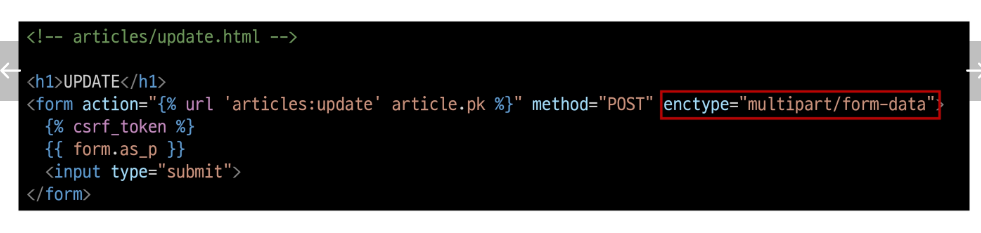
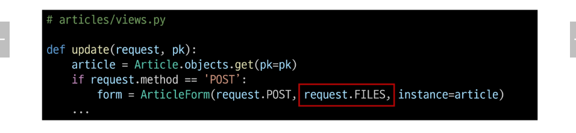

## Media Files
- 사용자가 웹에서 업로드하는 정적 파일(user-uploaded)

## 이미지 업로드
### ImageField()
- 이미지 업로드에 사용하는 모델 필드
- <strong>이미지 객체가 직접 DB에 저장되는 것이 아닌 '이미지 파일의 경로' 문자열이 저장됨

### 미디어 파일을 제공하기 전 준비사항
1. settings.py에 MEDIA_ROOT, MEDIA_URL 설정
2. 작성한 MEDIA_ROOT와 MEDIA_URL에 대한 URL 지정

### MEDIA_ROOT
- 미디어 파일들이 위치하는 디렉토리의 절대 경로
~~~Python
# settings.py

MEDIA_ROOT = BASE_DIR / 'media'
~~~

### MEDIA_URL
- MEDIA_ROOT에서 제공되는 미디어 파일에 대한 주소를 생성(STATIC_URL과 동일한 역할)
~~~Python
# settings.py

MEDIA_URL = 'media/'
~~~

### MEDIA_ROOT와 MEDIA_URL에 대한 URL 지정
- 업로드 된 파일의 URL == settings.MEDIA_URL
- MEDIA_URL을 통해 참조하는 파일의 실제 위치 == settings.MEDIA_ROOT

### 이미지 업로드
- blank=True 속성을 작성해 빈 문자열이 저장될 수 있도록 제약 조건 설정 -> "빈 문자열"
- 게시글 작성 시 이미지 업로드 없이도 작성 할 수 있도록 하기 위함

- migration 진행

- form 요소의 enctype 속성 추가

- ModelForm의 2번째 인자로 요청 받은 파일 데이터 작성
    - ModelForm의 상위 클래스 BaseModelForm의 생성자 함수의 2번째 위치 인자로 파일을 받도록 설정되어 있음

- 이미지 업로드 input 확인

## 업로드 이미지 제공
- 'url' 속성을 통해 업로드 파일의 경로 값을 얻을 수 있음
- article.image.url
    - 업로드 파일의 경로
- article.image
    - 업로드 파일의 파일 이름

- 업로드 이미지 출력 확인 및 MEDIA_URL 확인

- 이미지를 업로드하지 않은 게시물은 detail 템플릿을 렌더링할 수 없음
- 이미지 데이터가 있는 경우만 이미지를 출력할 수 있도록 처리하기

## 업로드 이미지 수정
- 수정 페이지 form 요소에 enctype 속성 추가

- update view 함수에서 업로드 파일에 대한 추가 코드 작성
