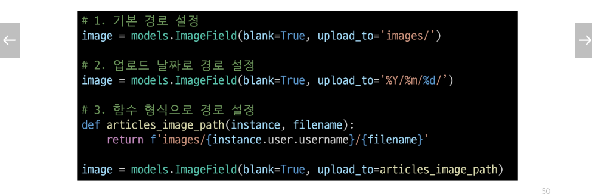

## 미디어 파일 추가 경로
### 'upload_to' argument
- MEDIA_ROOT 이후 경로로 설정
- ImageField()의 upload_to 속성을 사용해 다양한 추가 경로 설정

## BaseModelForm
### request.FILES가 두번째 위치 인자인 이유
- ModelForm의 상위 클래스 BaseModelForm의 생성자 함수 키워드 인자 참고

