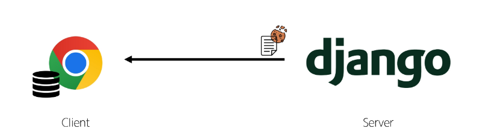

## Cookie & Session
### HTTP
- HTML 문서와 같은 리소스들을 가져올 수 있도록 해주는 규약
- 웹(WWW)에서 이루어지는 모든 데이터 교환의 기초

#### HTTP 특징
1. 비 연결 지향(connectionless)
    - 서버는 요청에 대한 응답을 보낸 후 연결을 끊음

2. 무상태(stateless)
    - 연결을 끊는 순간 클라이언트와 서버 간의 통신이 끝나며 상태 정보가 유지되지 않음

#### 상태가 없다는 것은
- 장바구니에 담은 상품을 유지할 수 없음
- 로그인 상태를 유지할 수 없음

## 쿠키(Cookie)
- 서버가 사용자의 웹 브라우저에 전송하는 작은 데이터 조각
<strong>서버가 제공하여 클라이언트 측에서 저장되는 작은 데이터 파일</strong>
<strong>사용자 인증, 추적, 상태 유지 등에 사용되는 데이터 저장 방식</strong>

### 쿠키 동작 예시
1. 브라우저가 웹 서버에 웹 페이지를 요청

2. 웹 서버는 요청된 페이지와 함께 쿠키를 포함한 응답을 브라우저에게 전송

3. 브라우저는 받은 쿠키를 저장소에 저장
쿠키의 속성(만료 시간, 도메인, 주소 등)도 함께 저장됨

4. 이후 브라우저가 같은 웹 서버에 웹 페이지를 요청할 때, 저장된 쿠키 중 해당 요청에 적용 가능한 쿠키를 포함하여 함께 전송

5. 웹 서버는 받은 쿠키 정보를 확인하고, 필요에 따라 사용자 식별, 세션 관리 등을 수행

6. 웹 서버는 요청에 대한 응답을 보내며, 필요한 경우 새로운 쿠키를 설정하거나 기존 쿠키를 수정할 수 있음
