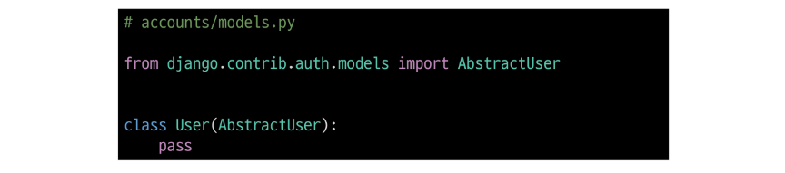
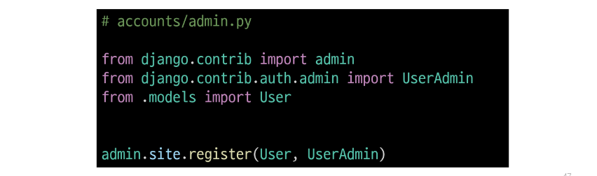

## User model 대체하기
### 기본 User Model의 한계
- 우리는 지금까지 별도의 User 클래스 정의 없이 내장된 auth 앱에 작성된 User 클래스를 사용했음
- Django의 기본 User 모델은 username, password 등 제공되는 필드가 매우 제한적
- 추가적인 사용자 정보(예: 생년월일, 주소, 나이 등)가 필요하다면 이를 위해 기본 User Model을 변경하기 어려움
    - 별도의 설정 없이 사용할 수 있어 간편하지만, 개발자가 직접 수정하기 어려움

### 내장된 auth 앱

### User Model 대체의 필요성
- 프로젝트의 특정 요구사항에 맞춰 사용자 모델을 확장할 수 있음
- 예를 들어 이메일을 username으로 사용하거나, 다른 추가 필드를 포함시킬 수 있음

### Custom User Model로 대체하기
- AbstractUser 클래스를 상속받는 커스텀 User 클래스 작성
- 기존 User 클래스도 AbstractUser를 상속받기 때문에 커스텀 User 클래스도 기존 User 클래스와 완전히 같은 모습을 가지게 됨

- django 프로젝트에서 사용하는 기본 User 모델을 우리가 작성한 User 모델로 사용할 수 있도록 AUTH_USER_MODEL 값을 변경
    - 수정 전 기본 값은 'auth.User'

- admin site에 대체한 User 모델 등록
    - 기본 User 모델이 아니기 때문에 등록하지 않으면 admin 페이지에 출력되지 않기 때문
    

## AUTH_USER_MODEL
- Django 프로젝트의 User를 나타내는 데 사용하는 모델을 지정하는 속성
- <strong>프로젝트 중간에 AUTH_USER_MODEL을 변경할 수 없음</strong>

#### 사용하는 User 테이블의 변화

### 프로젝트를 시작하며 반드시 User 모델을 대체해야 한다.
- Django는 새 프로젝트를 시작하는 경우 비록 기본 User 모델이 충분하더라도 커스텀 User 모델을 설정하는 것을 강력하게 권장하고 있음
- 커스텀 User 모델은 기본 User 모델과 동일하게 작동(1) 하면서도 필요한 경우 나중에 맞춤 설정(2) 할 수 있ㄱ 때문
- 단, User 모델 대체 작업은 프로젝트의 모든 migrations 혹은 첫 migrate를 실행하기 전에이 작업을 마쳐야 함