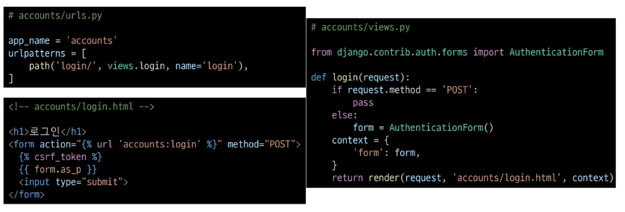
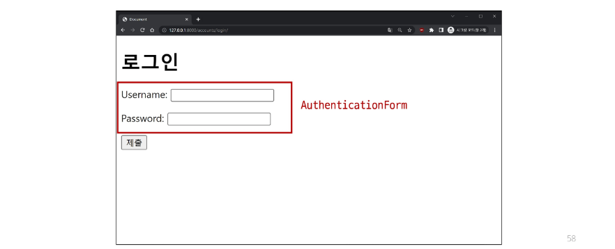
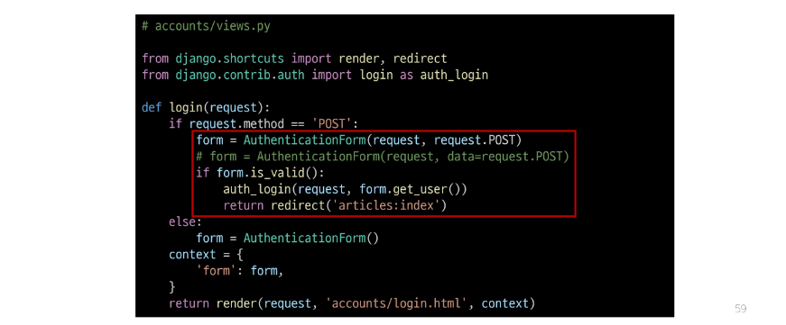
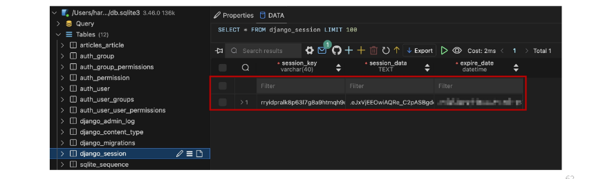
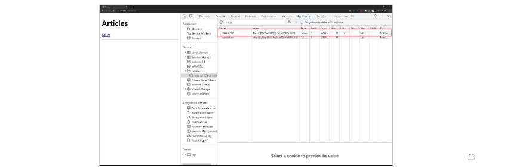
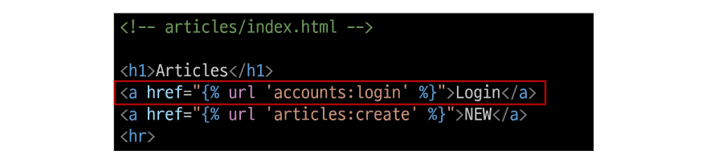

## Login
- 로그인은 Session을 Create하는 과정

### AuthenticationForm()
- 로그인 인증에 사용할 데이터를 입력 받는 built-in form

### 로그인 페이지 작성

### 로그인 로직 작성

### login(request, user)
- AuthenticationForm을 통해 인증된 사용자를 로그인 하는 함수

### get_user()
- AuthenticationForm의 인스턴스 메서드
- 유효성 검사를 통과했을 경우 로그인 한 사용자 객체를 반환

### 세션 데이터 확인하기
1. 로그인 후 발급받은 세션 확인
- django_session 테이블에서 확인

2. 브라우저 확인
- 개발자도구 - Application - Cookies

### 로그인 링크 작성
- 메인 페이지에 로그인 페이지로 갈 수 있는 링크 작성

