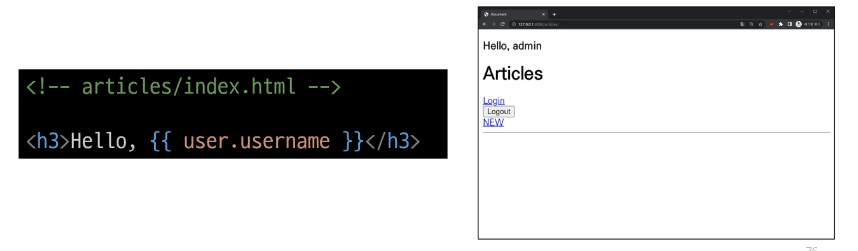
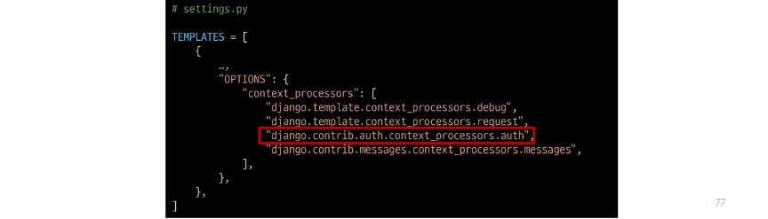

## Template with Authentication data
- 템플릿에서 인증 관련 데이터를 출력하는 방법

### 현재 로그인 되어있는 유저 정보 출력하기
- user라는 context 데이터를 사용할 수 있는 이유는?
    - django가 미리 준비한 context 데이터가 존재하기 때문(context processors)
    

### context processors
- 템플릿이 렌더링 될 떄 호출 가능한 컨텍스트 데이터 목록
- 작성된 컨텍스트 데이터는 기본적으로 템플릿에서 사용 가능한 변수로 포함됨
- django에서 자주 사용하는 데이터 목록을 미리 템플릿에 로드 해 둔 것

