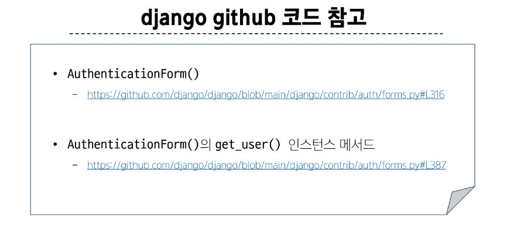
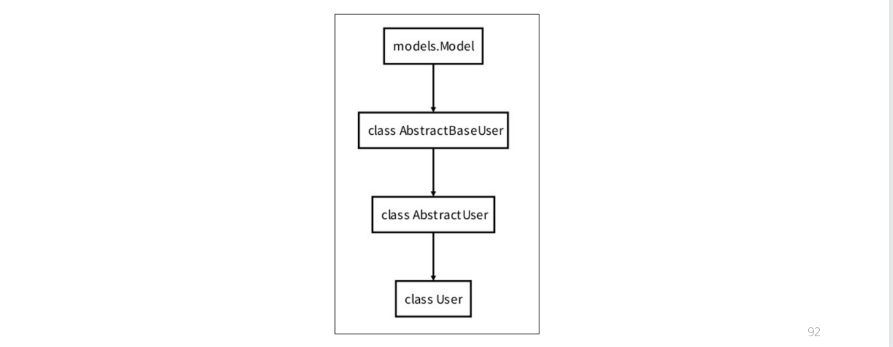

## 쿠키의 수명
### 쿠키 종류별 Lifetime (수명)
1. Session cookie
    - 현재 세션(current session)이 종료되면 삭제됨
    - 브라우저 종료와 함께 세션이 삭제됨

2. Persistent cookies
    - Expires 속성에 지정된 날짜 혹은 Max-Age 속성에 지정된 기간이 지나면 삭제됨

## 쿠키와 보안
### 쿠키의 보안 장치
- 제한된 정보
    - 쿠키에는 보통 중요하지 않은 정보만 저장(사용자 ID나 세션 번호 같은 것)

- 암호화
    - 중요한 정보는 서버에서 암호화해서 쿠키에 저장

- 만료 시간
    - 쿠키에는 만료 시간을 설정 시간이 지나면 자동으로 삭제

- 도메인 제한
    - 쿠키는 특정 웹사이트에서만 사용할 수 있도록 설정할 수 있음

### 쿠키와 개인정보 보호
- 많은 국가에서 쿠키 사용에 대한 사용자 동의를 요구하는 법규를 시행
- 웹사이트는 쿠키 정책을 명시하고, 필요한 경우 사용자의 동의를 얻어야 함

## Django에서의 세션 관리
### 세션 in Django
- Django는 'database-backed sessions' 저장 방식을 기본 값으로 사용
- session 정보는 DB의 django_session 테이블에 저장
- Django는 요청안에 특정 session id를 포함하는 쿠키를 사용해서 각각의 브라우저와 사이트가 연결된 session 데이터를 알아냄
- Django는 우리가 session 메커니즘(복잡한 동작원리)에 대부분을 생각하지 않게끔 많은 도움을 줌

## AuthenticationForm 내부 코드

## AbstractUser class
### 'AbstractUser' class
- "관리자 권한과 함께 완전한 기능을 가지고 있는 User model을 구현하는 추상 기본클래스"
- 몇 가지 공통 정보를 여러 다른 모델에 넣을 때 사용하는 클래스
- 데이터베이스 테이블을 만드는 데 사용되지 않으며, 대신 다른 모델의 기본 클래스로 사용되는 경우 해당 필드가 하위 클래스의 필드에 추가 됨

### User 모델 상속 관계

## User 모델 대체하기 Tip
- User 모델을 대체하는 순서를 숙지하기 어려울 경우 해당 공식문서를 보며 순서대로 진행하는 것을 권장
