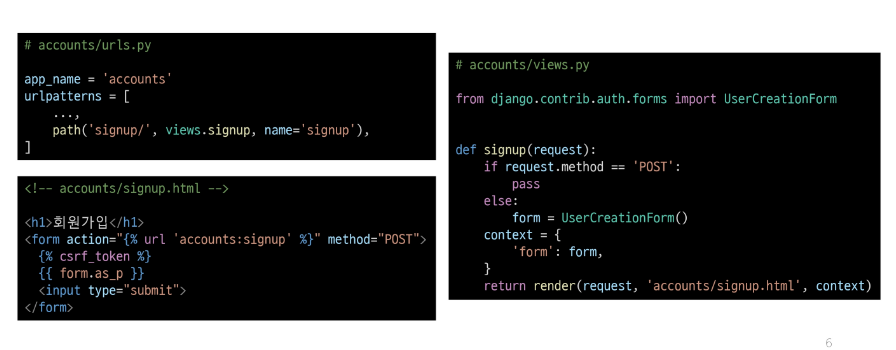
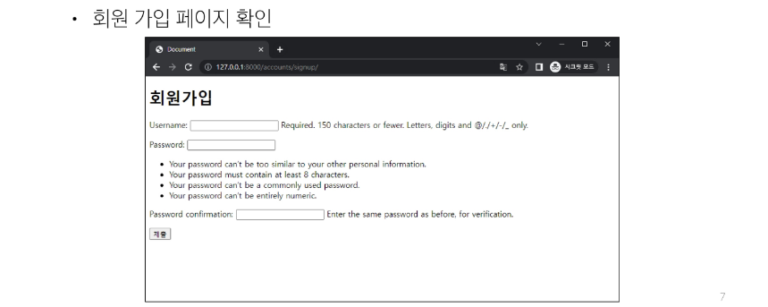
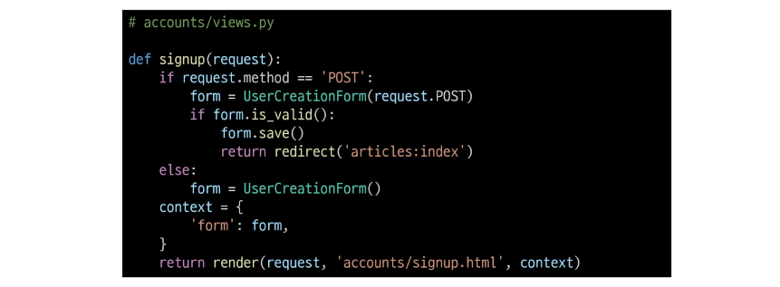
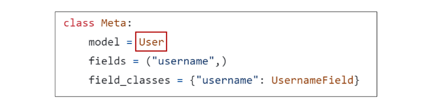
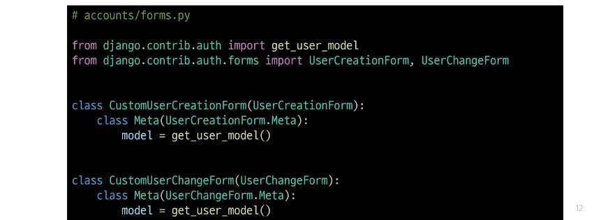
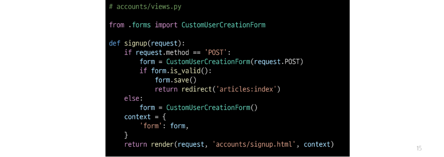

## 회원가입
- User 객체를 Create 하는 과정

### UserCreationForm()
- 회원 가입시 사용자 입력 데이터를 받는 built-in ModelForm

#### 회원 가입 페이지 작성

### 회원 가입 로직 작성

### 회원 가입 로직 에러
- 회원가입 시도 후 에러 페이지 확인
    - 
Manager isn't available; 'auth.User' has been swapped for 'accounts.User'

- 회원가입에 사용하는 UserCreationForm이 대체한 커스텀 유저 모델이 아닌 과거 Django의 기본 유저 모델로 인해 작성된 클래스이기 때문

### 커스텀 유저 모델을 사용하려면 다시 작성해야 하는 Form
1. UserCreationForm
2. UserChangeForm

- 두 Form 모두 class Meta: model = User가 작성된 Form이기 때문에 재작성 필요

### UserCreationForm과 UserChangeForm 커스텀
- Custom User model을 사용할 수 있도록 상속 후 일부분만 재작성

### get_user_model()
- "현재 프로젝트에서 활성화된 사용자 모델(active user model)"을 반환하는 함수

#### User 모델을 직접 참조하지 않는 이유
- get_user_model()을 사용해 User 모델을 참조하면 커스텀 User 모델을 자동으로 반환해주기 때문
- Django는 필수적으로 User 클래스를 직접 참조하는 대신 get_user_model()을 사용해 참조해야 한다고 강조하고 있음
- User model 참조에 대한 자세한 내용은 추후 모델 관계에서 다룰 예정

### 회원 가입 로직 완성
- CustomUserCreationForm으로 변경

