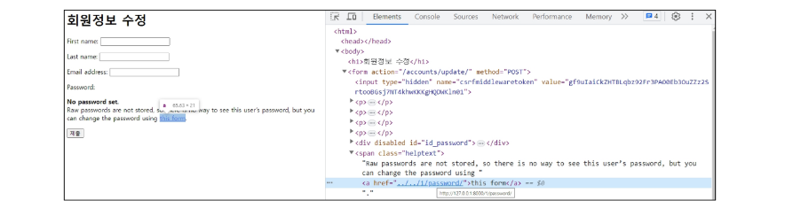
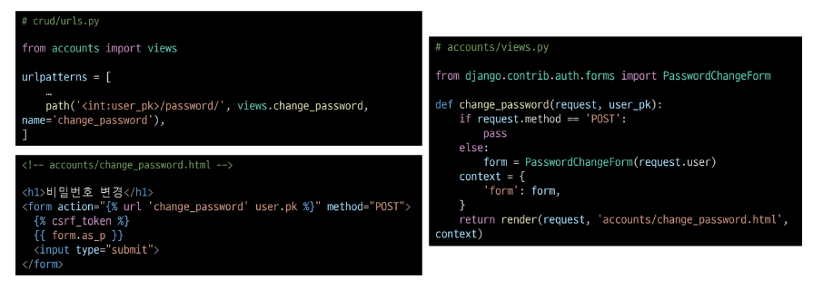
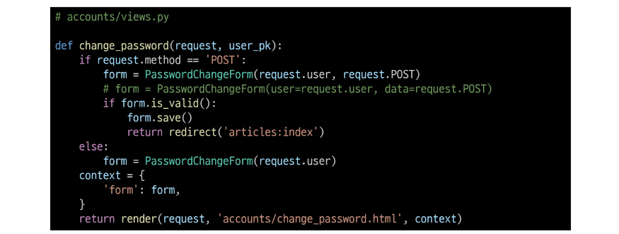
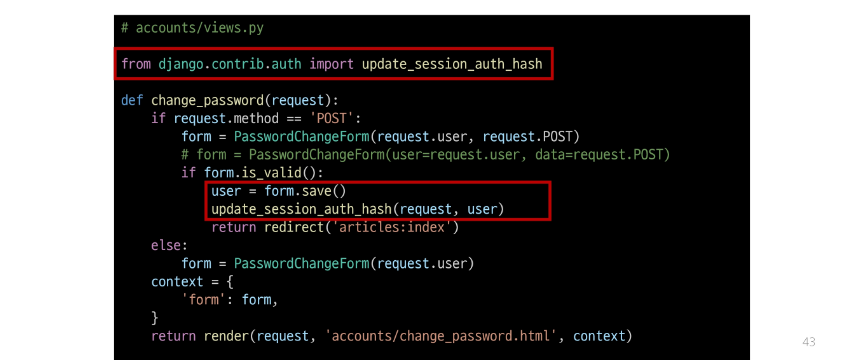

## 비밀번호 변경
- 인증된 사용자의  Session 데이터를 Update하는 과정

### PasswordChangeForm()
- 비밀번호 변경 시 사용자 입력 데이터를 받는 built-in Form

#### 비밀번호 변경 페이지 작성
- django는 비밀번호 변경 페이지를 회원정보 수정 form 하단에서 별도 주소로 안내
- /user_pk/password/

#### 비밀번호 변경 로직 완성

## 세션 무효화 방지
### 암호 변경 시 세션 무효화
- 비밀번호가 변경되면 기존 세션과의 회원 인증 정보가 일치하지 않게 되어 버려 로그인 상태가 유지되지 못하고 로그아웃 처리됨
- 비밀번호가 변경되면서 기존 세션과의 회원 인증 정보가 일치하지 않기 때문

### update_session_auth_hash(request, user)
- 암호 변경 시 세션 무효화를 막아주는 함수
- 암호가 변경되면 새로운 password의 Session Data로 기존 session을 자동으로 갱신

