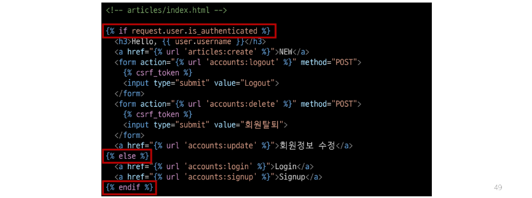
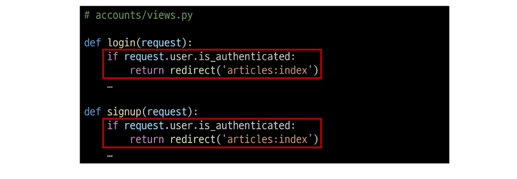
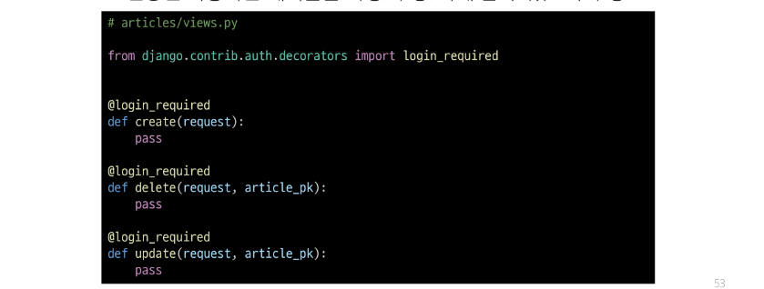
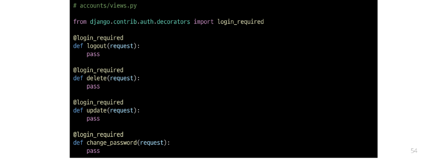

## 로그인 사용자에 대해 접근을 제한하는 2가지 방법
1. is_authenticated 속성
2. login_required 데코레이터

## is_authenticated 속성
- 사용자가 인증 되었는지 여부를 알 수 있는 User model의 속성
- 모든 User 인스턴스에 대해 항상 True인 읽기 전용 속성
- 비인증 사용자에 대해서는 항상 False

### is_authenticated 적용하기
- 로그인과 비로그인 상태에서 화면에 출력되는 링크를 다르게 설정하기

- 인증된 사용자라면 로그인/회원가입 로직을 수행할 수 없도록 하기

## login_required 데코레이터
- 인증된 사용자에 대해서만 view 함수를 실행시키는 데코레이터
- 비인증 사용자의 경우 /accoutns/login/ 주소로 redirect 시킴

### login_required 적용하기
- 인증된 사용자만 게시글을 작성/수정/삭제 할 수 있도록 수정

- 인증된 사용자만 로그아웃/탈퇴/수정/비밀번호 변경 할 수 있도록 수정
