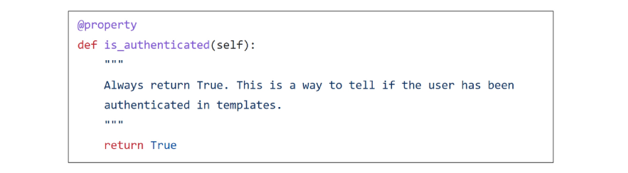
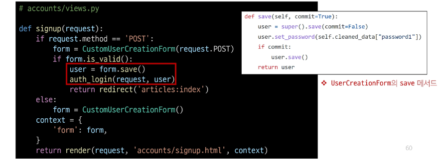
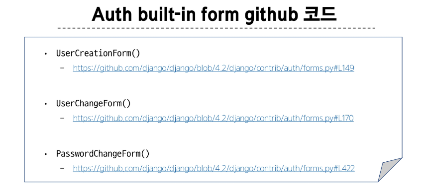

## is_authenticated 코드
- 메서드가 아닌 속성 값임을 주의

## 회원가입 후 자동 로그인
### 회원가입 후 로그인까지 이어서 진행하려면?
- 회원가입 성공한 user 객체를 활용해 login 진행

## 회원 탈퇴 개선
### 탈퇴와 함께 기존 사용자의 Session Data 삭제 방법
- 사용자 객체 삭제 이후 로그아웃 함수 호출
- 단, "탈퇴(1) 후 로그아웃(2)"의 순서가 바뀌면 안됨
- 먼저 로그아웃이 진행되면 해당 요청 객체 정보가 없어지기 때문에 탈퇴에 필요한 유저 정보 또한 없어지기 때문

## PasswordChangeForm 인자 순서
- PasswordChangeForm이 다른 Form과 달리 user 객체를 첫번째 인자로 받는 이유
- 부모 클래스인 SetPasswordForm의 생성자 함수 구성을 따르기 때문

## Auth built-in form 코드
