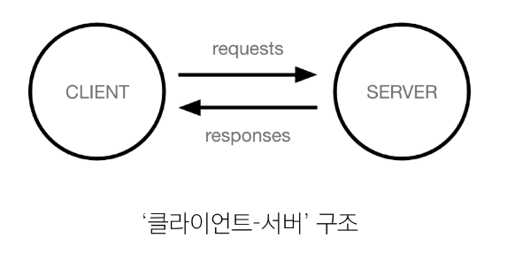
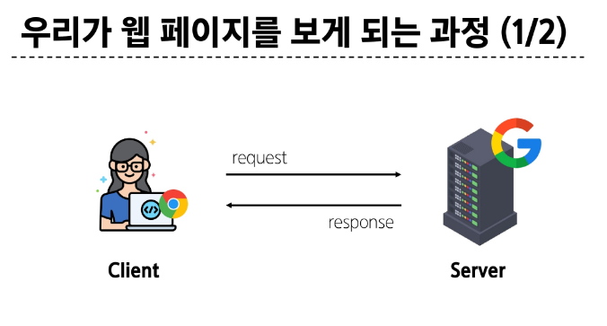

## 클라이언트와 서버
### 웹의 동작 방식
- 우리가 컴퓨터 혹은 모바일 기기로 웹 페이지를 보게 될 때까지 무슨 일이 일어날까?

### '클라이언트-서버' 구조

### Client(클라이언트)
- 서비스를 요청하는 주체(사용자의 웹 브라우저, 모바일 앱)

### Server(서버)
- 클라이언트의 요청에 응답하는 주체(웹 서버, 데이터베이스 서버)

1. 웹 브라우저(클라이언트)에서 'google.com'을 입력 후 에터
2. 웹 브라우저는 인터넷에 연결된 전세계 어딘 가에 있는 구글 컴퓨터(서버)에게 '메인 홈페이지.html' 파일을 달라고 요청
3. 요청을 받은 구글 컴퓨터는 데이터베이스에는 '메인 홈페이지.html' 파일을 찾아 응답
4. 웹 브라우저는 전달받은 '메인 홈페이지.html' 파일을 사람이 볼 수 있도록 해석해주고 사용자는 구글의 메인 페이지를 보게 됨

## Frontend & Backend
### Frontend(프론트엔드)
- 사용자 인터페이스(UI)를 구성하고, 사용자가 애플리케이션과 상호작용할 수 있도록 함
=> HTML, CSS, JavaScript, 프론트엔드 프레임워크 등

### Backend(백엔드)
- 서버 측에서 동작하며, 클라이언트의 요청에 대한 처리와 데이터베이스와의 상호작용 등을 담당
=> 서버 언어(Python, Java 등) 및 백엔드 프레임워크, 데이터베이스, API, 보안 등

## Web Framework
- 웹 애플리케이션을 빠르게 개발할 수 있도록 도와주는 도구(개발에 필요한 기본 구조, 규칙, 라이브러리 등을 제공)

### '웹 서비스 개발'에는 무엇이 필요할까?
- 웹 서비스 개발에 필요한 다양한 기술
    - 로그인/로그아웃, 회원관리, 데이터베이스, 보안 등
- 모든 기능을 직접 개발하기에는 현실적 어려움 존재
- 현대 웹 개발의 핵심
    - 잘 만들어진 도구를 효과적으로 활용하는 능력

## 왜 Django를 사용하는가
- 다양성
    - Python 기반으로 웹, 모바일 앱 백엔드, API 서버 및 빅데이터 관리 등 광범위한 서비스 개발에 적합

- 확장성
    - 대량의 데이터에 대해 빠르고 유연하게 확장할 수 있는 기능을 제공

- 보안
    - 취약점으로부터 보호하는 보안 기능이 기본적으로 내장되어 있음

- 커뮤니티 지원
    - 개발자를 위한 지원, 문서 및 업데이트를 제공하는 활성화 된 커뮤니티

