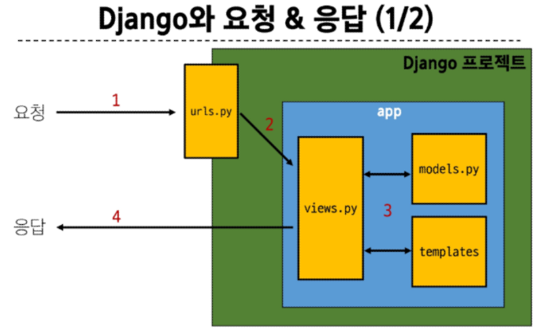
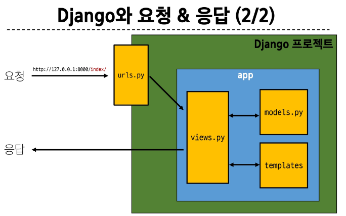
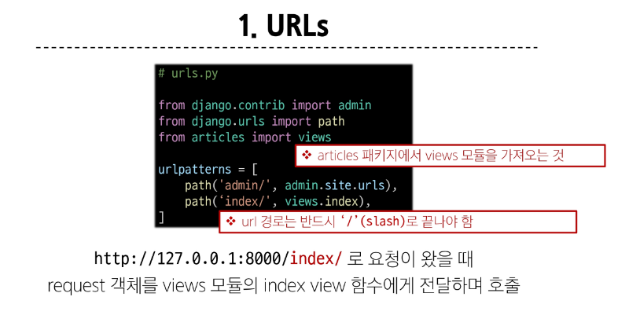
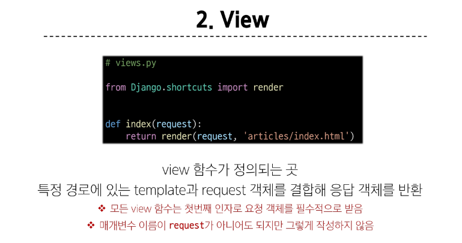
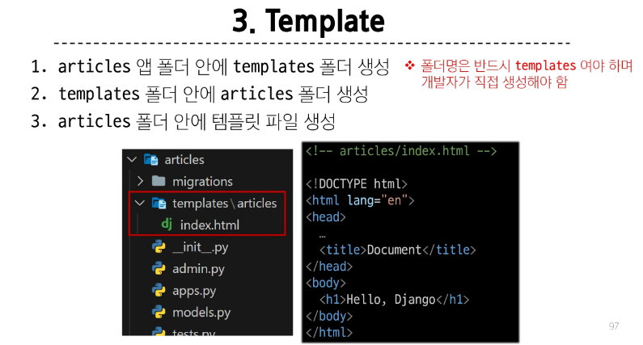
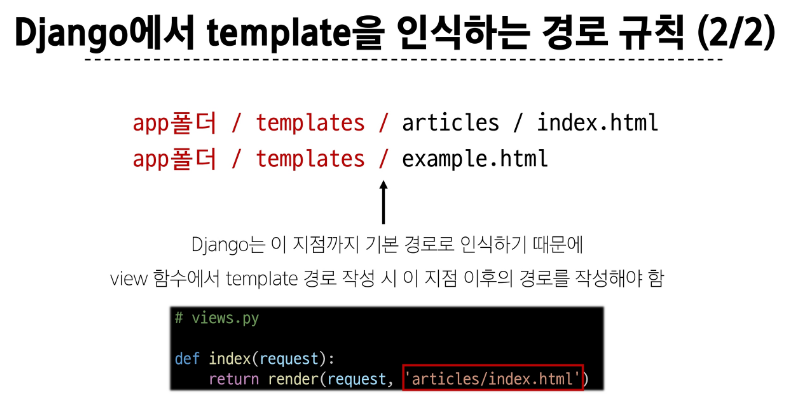
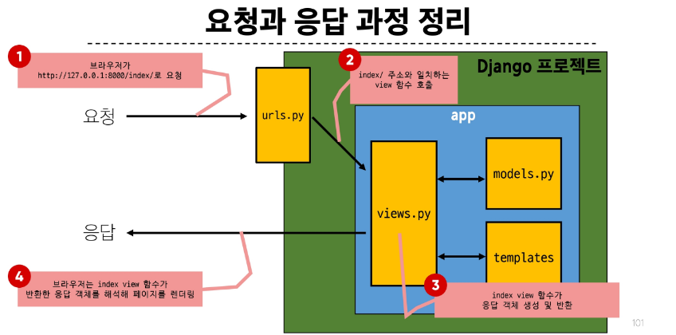

## Django에서의 요청과 응답

### 1. URLs

### View

### Template

### Django에서 template을 인식하는 경로 규칙

### 요청과 응답 과정 정리

### 데이터 흐름에 따른 코드 작성하기
URLs -> View -> Template

URLs
~~~Django
path('articles/', views.index,)
~~~

View 
~~~Django
def index(request):
    return render(request, 'articles/index.html')
~~~

Template
~~~Django
articles/templates/articles/index.html
~~~

