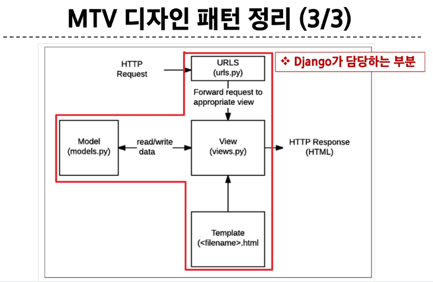

## 가상환경 생성 루틴
### Django 프로젝트 생성 전 루틴
1. 가상환경(venv) 생성
~~~
$ python -m venv venv
~~~

2. 가상환경 활성화
~~~
$ source venv/Scripts/activate
~~~

3. Django 설치
~~~
$ pip install django
~~~

4. 패키지 목록 파일 생성
~~~
$ pip freeze > requirements.txt
~~~

### Django 프로젝트 생성 루틴 정리 + git
1. 가상 환경 생성
2. 가상 환경 활성화
3. Django 설치
4. 패키지 목록 파일 생성 (패키지 설치시마다 진행)
5. .gitignore 파일 생성 (첫 add 전)
6. git 저장소 생성 (git init)
7. Django 프로젝트 생성

## Django 관련
### render 함수
- 주어진 템플릿을 주어진 컨텍스트 데이터와 결합하고 렌더링 된 텍스트와 함께 HttpResponse 응답 객체를 반환하는 함수
1. request
- 응답을 생성하는 데 사용되는 요청 객체

2. template_name
- 템플릿 이름의 경로

3. context
- 템플릿에서 사용할 데이터(딕셔너리 타입으로 작성)
~~~
render(request, template_name, context)
~~~

### MTV 디자인 패턴 정리
- Model
    - 데이터와 관련된 로직을 관리
    - 응용프로그램의 데이터 구조를 정의하고 데이터베이스의 기록을 관리

- Template
    - 레이아웃과 화면을 처리
    - 화면상의 사용자 인터페이스 구조와 레이아웃을 정의

- View
    - Model & Template과 관련한 로직을 처리해서 응답을 반환
    - 클라이언트의 요청에 대해 처리를 분기하는 역할

- View 예시
    - 데이터가 필요하다면 model에 접근해서 데이터를 가져오고, 가져온 데이터를 template로 보내 화면을 구성하고, 구성된 화면을 응답으로 만들어 클라이언트에게 반환

### MTV 디자인 패턴 정리
'

## Django 규칙
1. urls.py에서 각 url 문자열 경로는 반드시 '/'로 끝남

2. views.py에서 모든 view 함수는 첫번째 인자로 요청 객체를 받음
    - 매개변수 이름은 반드시 request로 지정하기

3. Django는 특정 경로에 있는 template 파일만 읽어올 수 있음
    - 특정 경로: app폴터/templates/