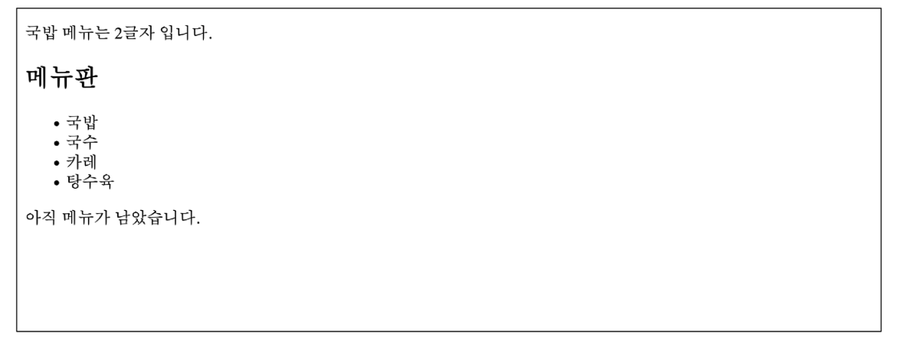

## Django Template System
- 데이터 표현을 제어하면서, 표현과 관련된 부분을 담당

### HTML의 콘텐츠를 변수 값에 따라 변경하기
~~~html
<!-- articles/index.html -->

<body>
    <h1>Hello, django!</h1>
</body>
~~~

---------- 변경 후 ----------
~~~python
# articles/views.py

def index(request):
    # 딕셔너리 형태
    context = {
        'name': 'Jane',
    }
    return render(request, 'articles/index.html', context)
~~~

~~~html
<!-- articles/index.html -->

 <body>
    <h1>Hello, {{name}}</h1>
</body>
~~~

## Django Template Language(DTL)
- Template에서 조건, 반복, 변수 등의 프로그래밍적 기능을 제공하는 시스템

### DTL Syntax
1. Variable
2. Filters
3. Tags
4. Comments

### Variable
- render 함수의 세번째 인자로 딕셔너리 데이터를 사용
- 딕셔너리 key에 해당하는 문자열이 template에서 사용 가능한 변수명이 됨
- dot('.')를 사용하여 변수 속성에 접근할 수 있음
~~~
{{varaible}}
{{variable.attribute}}
~~~

### Filters
- 표시할 변수를 수정할 때 사용 (변수+ '|' + 필터)
- chained(연결)이 가능하며 일부 필터는 인자를 받기도 함
- 약 60개의 built-in template filters를 제공
~~~
{{variable|filter}}
{{name|truncatewords:30}}
~~~

### Tags
- 반복 또는 논리를 수행하여 제어 흐름을 만듦
- 일부 태그는 시작과 종료 태그가 필요
- 약 24개의 built-in template tags를 제공
~~~



~~~

### Comments
- DTL에서의 주석
~~~
<h1>Hello, {# name #}</h1>
~~~

~~~

...

~~~

### DTL 예시
~~~python
# urls.py

urlpatterns = [
    path('admin/', admin.site.urls),
    path('index/', views.index),
    path('dinner/', views.dinner),
]
~~~

~~~python
# views.py

import random

def dinner(request):
    foods = ['국밥', '국수', '카레', '탕수육',]
    picked = random.choice(foods)
    context = {
        'foods': foods,
        'picked': picked,
    }
    return render(request, 'articles/dinner.html', context)
~~~

~~~html
<!-- articles/dinner.html -->

 
{{ picked }} 메뉴는 {{ picked|length }}글자 입니다.

 <h2>메뉴판</h2>
 <ul>
    
        <li>{{ food }}</li>
    
</ul>


    
메뉴가 소진 되었습니다.


    
아직 메뉴가 남았습니다.


~~~

